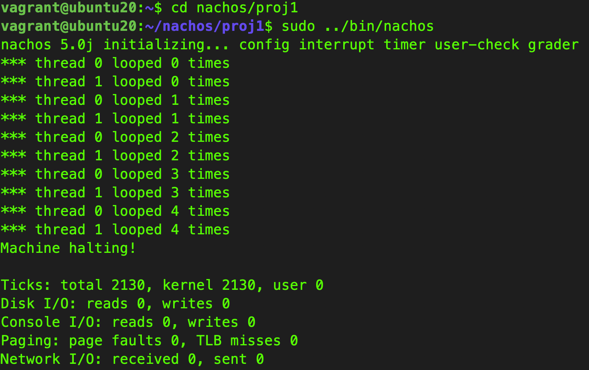

### This project is to set up Nachos 3.4 using JAVA in Ubuntu 20.04 , Vagrant

### Getting started

```bash
vagrant up
vagrant ssh

# ssh into the vm and run the comand below

cd /home/vagrant/nachos/proj1
sudo make 
sudo ../bin/nachos


```

> If you see the example output below, you successfully execute the nachos proj1 !

### Example output


```bash
### Example output
# nachos 5.0j initializing... config interrupt timer user-check grader
# *** thread 0 looped 0 times
# *** thread 1 looped 0 times
# *** thread 0 looped 1 times
# *** thread 1 looped 1 times
# *** thread 0 looped 2 times
# *** thread 1 looped 2 times
# *** thread 0 looped 3 times
# *** thread 1 looped 3 times
# *** thread 0 looped 4 times
# *** thread 1 looped 4 times
# Machine halting!

# Ticks: total 2130, kernel 2130, user 0
# Disk I/O: reads 0, writes 0
# Console I/O: reads 0, writes 0
# Paging: page faults 0, TLB misses 0
# Network I/O: received 0, sent 0
```

### Reference
[Nachos_Tutorial from cas mcmaster](http://www.cas.mcmaster.ca/~rzheng/course/Nachos_Tutorial/nachossu2.html)

[FAQ from washington.edu](https://homes.cs.washington.edu/~tom/nachos/FAQ)

[.berkeley.edu](https://people.eecs.berkeley.edu/~kubitron/courses/cs162-F10/Nachos/index.html)

[cdcn article in Mandarin](https://blog.csdn.net/weixin_43679657/article/details/115429168?)